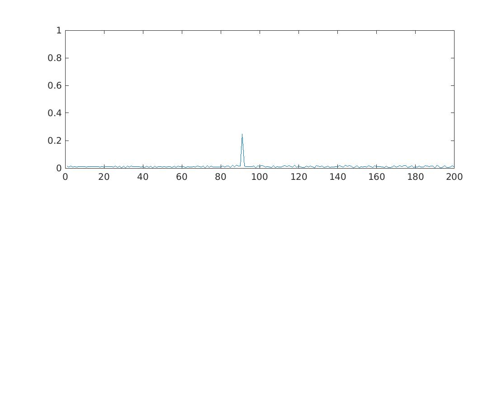
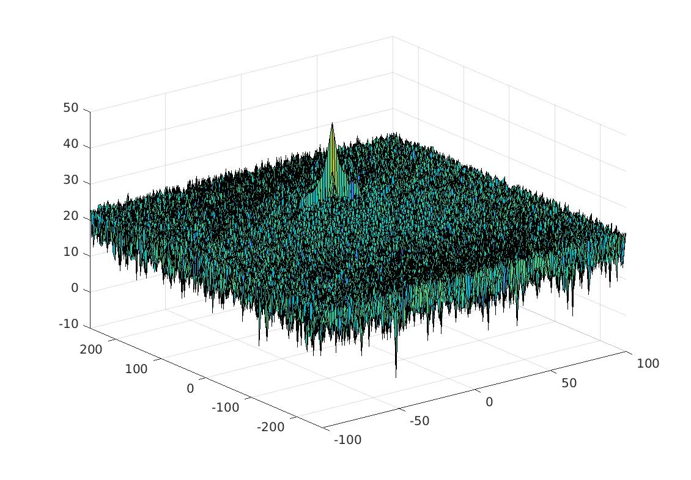
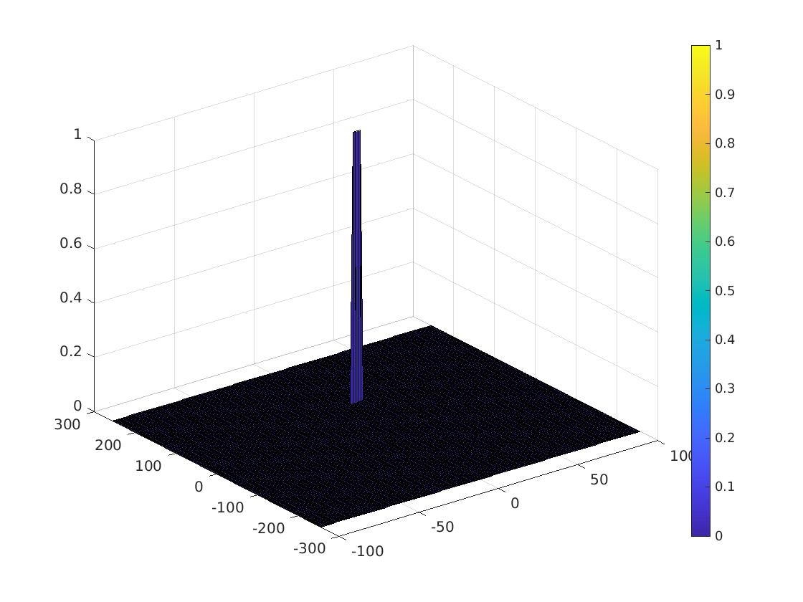

# SFND Radar Target Generation and Detection

In this project, radar data is generated for a user defined target and range. 
``` Matlab
R=90;  % initial range of the target
v=10;  % velocity
```

Further a FMCW (Frequency-Modulated Continuous-Wave) radar waveform  was generated for the given Radar spdcifications
```
% Frequency of operation = 77GHz
% Max Range = 200m
range_max = 200;
% Range Resolution = 1 m
delta_r =1;
% Max Velocity = 100 m/s
max_v =100;
```

This was used for signal generation to simulate a moving target for the earlier user defined values.

To determine that the signal generation process was correct the range measurement was confirmed from the First FFT.


The objective of this project, was to implement a 2D CFAR (Constant False Alarm Rate) detector process and visualise its output. 

## Implementation steps for the 2D CFAR process

A 2D FFT implmentation was given to create a Range Doppler Map (RDM) which was used as input into the CFAR process.
  

A loop was created along the Range and Doppler axis giving starting from the first CUT (Cell Under Test) to the last. The CUT cell is surrounded by guard and then training cells.

For each sliding window centered around the CUT cell, a noise level was created by summing each training cell value, in the window (converted first from logarithmic to linear), 
then the summed values were averaged by the number of training cells in the window, before being converted back to a logarithmic value. An offset was added to the noise level, to create a threshold. If the CUT cell, exceeded the threshold a 1 was assigned otherwise it was equated to 0.

## Selection of Training, Guard Cells and offset
Training cells for both Radar and Dippler dimensions choosen were:
```
Tr=2;
Td=3;
```
with the following for the guard cells
```
Gr=2;
Gd=3;
```
giving this training mask, where 1 identifies a training cell
```
     1     1     1     1     1     1     1     1     1     1     1     1     1
     1     1     1     1     1     1     1     1     1     1     1     1     1
     1     1     1     0     0     0     0     0     0     0     1     1     1
     1     1     1     0     0     0     0     0     0     0     1     1     1
     1     1     1     0     0     0     0     0     0     0     1     1     1
     1     1     1     0     0     0     0     0     0     0     1     1     1
     1     1     1     0     0     0     0     0     0     0     1     1     1
     1     1     1     1     1     1     1     1     1     1     1     1     1
     1     1     1     1     1     1     1     1     1     1     1     1     1

```
An offset of `15` was choosen via trial and error with the above Training and Guard Cells specification.


## Steps taken to suppress the non-thesholded cells at the edge

A loop was constructed to walk through all cell combinations. A cell was suppressed ie set to 0, if the non-thresholded cells was at the edges
``` Matlab
for i = 1: Nr/2
    for j = 1: Nd
        if i <= Gr+Tr || i >= Nr/2 - (Gr+Tr) || j <= Gd+Td || j >= Nd-(Gd+Td)
            CFAR(i,j) = 0;
        end
    end
end
```
##2D CFAR Output

